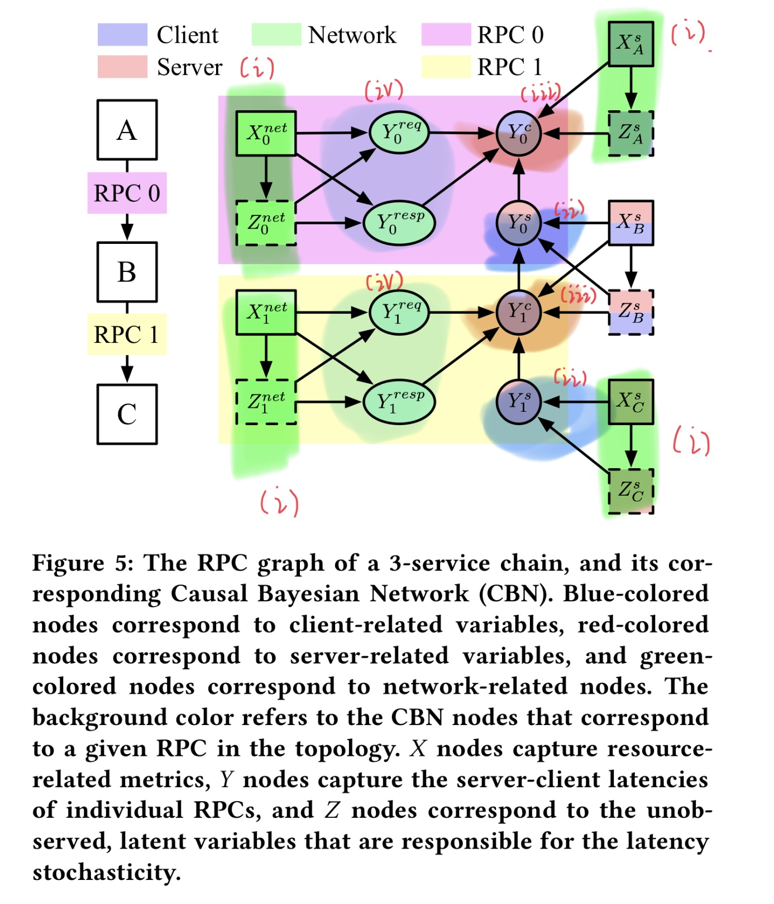

# Paper-Reading-OS-Bugs
 简单记录一下读过的OS-Bugs相关比较有意思的paper，方便以后要用的时候找到

## Correlating instrumentation data to system states- A building block for automated diagnosis and control (OSDI2004)
### Concepts
- Service Level Objectives (SLOs): [SLI, SLO, and SLA Difference](https://ikala.cloud/understanding-sli-slo-sla-in-sre/)
- Three-tier Web Service: [Three-tier Arch.(1)](https://www.ibm.com/hk-en/cloud/learn/three-tier-architecture), [Three-tier Arch.(2)](https://www.techtarget.com/searchsoftwarequality/definition/3-tier-application)
- Tree-augmented naive Bayesian network (TAN): [NB vs. TAN](https://gmis.jiqizhixin.com/graph/technologies/f743c6ed-68c5-4cc1-963f-c66413733e6e)
- TBD

### Tools
- HP OpenView: Monitor system and get metrics
- TPC-W: A transactional web e-Commerce benchmark
- Java Petstore: [The reference application for building Ajax web applications on Java Enterprise Edition 5 platform](https://www.oracle.com/java/technologies/java-pet-store.html)
- TBD

### Notes
- 目的是做一个分类器，输入是系统的一些运行时信息(metrics)，输出是系统的SLO是否被违背；
- 借助于TANs作为分类器所带来的可解释性，我们也得以发现SLO违背与哪部分metrics有关，以及metrics对应的阈值，换而言之能够发现引起SLO违背的表面原因；
- 由于metrics与系统组件有关(i.e., 你考试没考好你爸打你而不是隔壁王叔叔打你)，我们能够进一步推断系统的哪些组件、资源或进程导致了SLO违背，换而言之能够发现引起SLO违背的根本位置与原因；
- 使用balanced accuracy (BA)而非普通的accuracy(i.e., 这里有歧义，作者这里其实指代的是只考虑TP的precision，现在用于模型评估的accuracy与作者提出的BA类似也同时考虑TP和TN，参考[混淆矩阵的相关概念](https://blog.csdn.net/qq_38436431/article/details/120538673))来进行评估，BA其实就是$\frac{TP+TN}{2}$；
- 得到分类器后通过判断$P(s^+|\vec{M})>P(s^-|\vec{M})$来判断输入的sub-metrics与SLO违背是否有强的联系，有点怪因为这应该与sub-metrics中的具体取值有关，但是 intuitively符合理解；
- 选择sub-metrics基于贪心算法，每次多选一个对模型提升最大的metric，重复直至sub-metrics数量足够，从而获得最佳模型；
- Modifiability这点很有意思但是没有具体展开讲述，仅仅给出了两篇相关工作；
- 三种实验设定RAMP,STEP, and BUGGY模拟了用户访问对服务器造成的不同压力情况；
- 模型对SLO改变很敏感，作者建议根据实际production环境的需求改变模型的输入metrics来提升准确度；
- 通过提前一段时间来采样可以把TAN当成预测器用，在STEP下效果不理想，很显然因为workload会骤变，好的分类器用的指标和好的预测器的不太一样，作者没有解释只是提到这一点；

## HangFix: Automatically Fixing Software Hang Bugs for Production Cloud Systems

### Concepts
- Hadoop Distributed File System (HDFS): [HDFS Noob Tutorial](https://zhuanlan.zhihu.com/p/21249592)
- Remote Procedure Call (RPC): [What's RPC](https://www.jianshu.com/p/7d6853140e13)
- Blocking Methods: [Blocking Methods in Java](https://www.geeksforgeeks.org/blocking-methods-in-java/)

### Tools
- Java Virtual Machine Stack Trace (jstack): jstack prints Java stack traces of Java threads for a given Java process or core file or a remote debug server
- Dscope/Tscope: [Hang bug detector1](https://dl.acm.org/doi/10.1145/3267809.3267844), [Hang bug detector2](https://ieeexplore.ieee.org/document/8498121)

### Notes
- 目的是自动化对云计算系统中的hang bug进行修复，具体而言输入是系统/应用bytecode和能产生bug的test case，输出是该bug的fix patch；
- 方法分为4步: 1)利用stack trace来确定hang在哪个函数 2)我们会有一些预定义的hang bug root cause pattern(i.e., 3种infinite loop和一种blocking)，用step1中确定的函数去match最匹配的pattern 3)每个pattern会有我们设计好的fix patch，插进去 4)再跑一遍detector和一些回归测试看看是否成功fix 
- Step1中利用jstack获取不同stack trace dump files，比对得到重复出现的functions，并选取其中处于栈顶的那一个便是hang function，直觉上讲这个算法符合hang bug的特点；
- Step2中如果hang function有多个loop怎么判断是哪个引发hang，全都与pattern做一下match么，好像没有看到相关的解释；
- Step2&3中pattern以及对应的fix都是人工定义的，如果pattern的编写有一套系统化的规则方便开发者/运维人员添加那会很好，当然如果这部分能够自动化会更好，同时pattern的表示和对应fix在本文中局限于java(i.e., Java IR code)，或许可以用更加general的表示达到cross-language的效果，因为之前读过一篇[相关的文章虽然不是针对hang bug fixing的](https://dl.acm.org/doi/10.1145/3468264.3468538)但是对这两点都做到了，maybe套过来可行；
- 对许多real-world hang bugs跑了一下实验，效果还是很不错的，fix patch产生速度很快同时成功率很高，并且不会造成什么overhead毕竟基本上就是加一个checker code block；
- 对于pattern matching和fix patch inserting的细节仍然不太清楚，可能要阅读源代码才能知道，不过读这篇主要目的是想用作者提供的数据集做自己的实验，按照github上的readme能跑通作者提供的`triggerbug_xxxx.sh`应该就够了；
- Hangfix的输入testcase似乎都是手写的，或许可以研究如何自动化去生成；

## Sage: Practical & Scalable ML-Driven Performance Debugging in Microservices

### Concepts
- Quality of Service(QoS): [What's QoS](https://info.support.huawei.com/info-finder/encyclopedia/zh/QoS.html)
- Variational graph auto-encoders(VGAE): [VGAE Paper Explanation](https://zhuanlan.zhihu.com/p/78340397)
- Service Level Agreement(SLA): [What's SLA](https://www.cio.com/article/274740/outsourcing-sla-definitions-and-solutions.html)
- Causal Bayesian Network(CBN): 按照[Difference between BN and CBN](https://stackoverflow.com/questions/2113570/what-is-the-difference-between-causal-models-and-directed-graphical-models)的说法两者有区别，但是这篇paper中似乎CBN指的就是BN
- Mutal Information: [What's mutal info.](https://blog.csdn.net/qq_40131306/article/details/124167150)
- But-for test: [The but-for test](https://www.enjuris.com/personal-injury-law/the-but-for-test/)，法学中判断个体有罪的逻辑
- Conditional Variational AutoEncoder(CVAE): [VAE v.s. CVAE](https://www.jianshu.com/p/94d68a03c13e)
- Catastrophic forgetting: [Forgeting in Deep Learning](https://towardsdatascience.com/forgetting-in-deep-learning-4672e8843a7f)
- Continuous Training: [Retraining Model During Deployment: Continuous Training and Continuous Testing](https://neptune.ai/blog/retraining-model-during-deployment-continuous-training-continuous-testing),paper中主要采用selective partial retraining和incremental retraining两种策略
- N-socket server: [What Is a Server CPU?](https://community.fs.com/blog/what-is-a-server-cpu.html),简单而言n-socket就指最高支持n-core
- Coefficient of Determination ($R^2$): [Coefficient of Determination ($R^2$) | Calculation & Interpretation](https://www.scribbr.com/statistics/coefficient-of-determination/#:~:text=What%20is%20the%20definition%20of,predicted%20by%20the%20statistical%20model.)
- Tail latency: [Tail Latency Might Matter More Than You Think](https://brooker.co.za/blog/2021/04/19/latency.html#:~:text=Tail%20latency%2C%20also%20known%20as,but%20sometimes%20takes%20around%20100ms%22.)

### Tools
- Dapper, Zipkin, Jaeger, Google-Wide Profiling(GWP): Production-level distributed tracing systems
- Jaeger: A RPC-level latency tracing system
- Prometheus: A container/node-level usage monitoring system including Node Exporter, Black box Exporter. and cAdvisor
- Apache Thrift: RPC framework
- DeathStarBench: Open-source benchmark suite for cloud microservices
- Chaos Monkey: Chaos engineering tool that creates fault injection tests

### Notes
- 目的是做一个root cause定位和即时修复的系统，输入是系统的一些metrics，输出ervice-和resource-level的root cause以及对应的修复(e.g., adjust CPU freq., scale out/up the microservice, partition the LLC)
- Sec.2-Related Work部分介绍了很多实用的数据集和工具，以后可能用得上
- CBN的设计初看有点迷惑，但是其实是基于四条规则，而这四条规则源于Sec.3-2中介绍的RPC延迟传播规律，Fig.5很好展示了一个简单的RPC chain对应的CBN的全貌，
- 对于一个常规的预测任务我们没必要知道Z也就是latent space的情况，但是作者在这里去计算的分布十分关注Z，原因在于Sage需要的是一个生成模型，生成模型需要latent vector从而去enocde/decode输入
- enDeps($Z^s_j$)中包含了$Y_{v\_structure(j)}$，通过Fig.5可以了解到这指代什么但是不确定为什么需要这个，文章只说"derived from the information flow according to the structure of the CBN" (呜呜，我，概率论，菜菜)
- SREs常常改变有可能的root cause variable并固定其他所有变量/设备来测试哪里出问题，Sage采用类似的方法，改变某个X然后利用latent vector(Z)生成Y，看Y是否正常，换言之，利用CBN和生成网络模拟SREs做的事情从而不需要在物理上进行测试，降低了性能损耗与时间
- Sage infer root cause时分两步，先service-后resource-level，two-step的方案会比jointly输出两者更好
- Sage的retraining部分采用selective partial retraining和incremental retraining两种策略，简单而言，前者只重训练升级node及其子结点，后者指新模型的初始参数沿用之前模型的，除此之外在RPC图不变情况下只升级GVAE，同时由于新插入的微服务组建只影响上游组件的对应模型不影响下游，故而也只需要retrain上游model
- 从识别和修复准确率上来看Seer和Sage差不太多，Sage的优点在于无需很多system stack级别的插桩获得输入数据从而拥有在real-word中更高的practicality
- Tracing frequency对Sage的表现影响不大，这是很优秀的特点，许多基于时序pattern的检测系统在实际中很难应用而Sage不使用pattern从而避免了这一问题
- Sage在设计上考虑地非常周到且实际效果很好，细节很多如果之后要用到这篇paper的内容需要再仔细看下MarginNote里重点划出的地方

## Trace Analysis Based Microsoft Architecture Measurement

### Concepts
- Horizontal pod autoscaler(HPA): [kubernetes自动扩容之Horizontal Pod Autoscaling(HPA)](https://www.cnblogs.com/linux20190409/p/10976222.html)
- Command and Query Responsibility Segregation(CQRS): [CQRS pattern](https://learn.microsoft.com/en-us/azure/architecture/patterns/cqrs), [DDD中的那些模式—CQRS](https://zhuanlan.zhihu.com/p/115685384)
- Cyclomatic Complexity: [代码的圈复杂度](https://zhuanlan.zhihu.com/p/139386961), [What Is Cyclomatic Complexity?](https://www.perforce.com/blog/qac/what-cyclomatic-complexity#:~:text=Cyclomatic%20complexity%20(CYC)%20is%20a,the%20more%20complex%20the%20code.)

### Tools
- Neo4j: World’s leading Graph Database

### Notes
- 目的是评估一个微服务系统架构，通过设计的14个指标来看系统架构是否设计得完善，输入是系统的trace
- 在Trace的处理上对OpenTracing作了拓展，主要两方面1)为每个span记录它的data access(i.e.,主要是通过数据库操作) 2)将trace抽象成了不同类别，当然随之也为span和request抽象
- 14个指标的设计很有意思，都比较符合经验性的、直觉上的理解

## DeepTraLog: Trace-Log Combined Microservice Anomaly Detection through Graph-based Deep Learning

### Concepts
- Support Vector Data Description(SVDD): [SVDD基本原理](https://blog.csdn.net/qq_35356741/article/details/115266192)
- Global Vectors for Word Representation(GloVe): [GloVe学习](https://blog.csdn.net/XB_please/article/details/103602964)
- t-Distributed Stochastic Neighbor Embedding(t-SNE): [An Introduction to t-SNE with Python Example](https://towardsdatascience.com/an-introduction-to-t-sne-with-python-example-5a3a293108d1)

### Tools
- OpenTracing, SkyWalking: Distributed tracing tools
- Drain: [Drain3 is an online log template miner that can extract templates (clusters) from a stream of log messages in a timely manner.](https://github.com/logpai/Drain3)
- Term frequency–Inverse document frequency(TF-IDF): [机器学习：生动理解TF-IDF算法](https://zhuanlan.zhihu.com/p/31197209)
- Fudan SELab train-ticket-fault-replicate dataset: [Train-ticket数据集的fault-inject版本](https://github.com/FudanSELab/train-ticket-fault-replicate)

### Notes
- 目的是做个异常检测器，输入是traces and logs，输出是是否异常，模型使用基于SVDD的GGNN
- 出发点是现有的方法要么只用trace要么只用log，这有两个不足之处1)假设服务A和服务B上的log对于某一状态的描述冲突也就意味着出现异常，仅仅使用trace或者log都无法发现问题 2)log和trace的结合不能用序列表示，考虑到异步以及并行调用log和trace的顺序并非一定的，但是他们之间的结构是一定的，也就是调用图，所以应该用图表示
- TEG的表示基于点集、邻接矩阵和点特征矩阵，似乎是不包含边的信息描述，这会丢失一部分信息，不知道是受限于GGNN还是缺少好的对边的编码方式(i.e.,边特征向量)
- 虽然在VIS时候会标出哪些node对于产生异常的贡献最大，从而方便定位trace中可能哪里出现了问题，然而即使从Fig.5中也不难发现标出的node很多，而且基于Eq.5计算出的每个node的分数为什么就能反映该node问题比较大，这是缺少严格的论证的，只是比较符合直觉，这样的异常检测器的可解释性比较差，不利用进一步对异常原因进行定位和分析
- 对于使用Deep Learning相关技术的paper还是比较希望对于work和不work的情况做些case study，基于图表示的方法虽然有效但是它到底能检测到哪些不能检测到哪些依然不清不出
- 